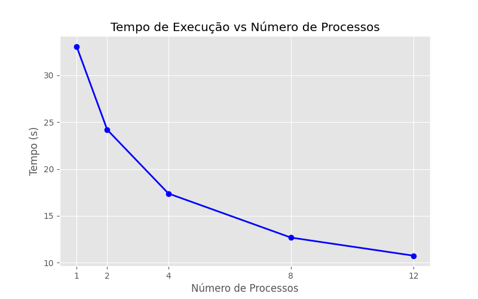
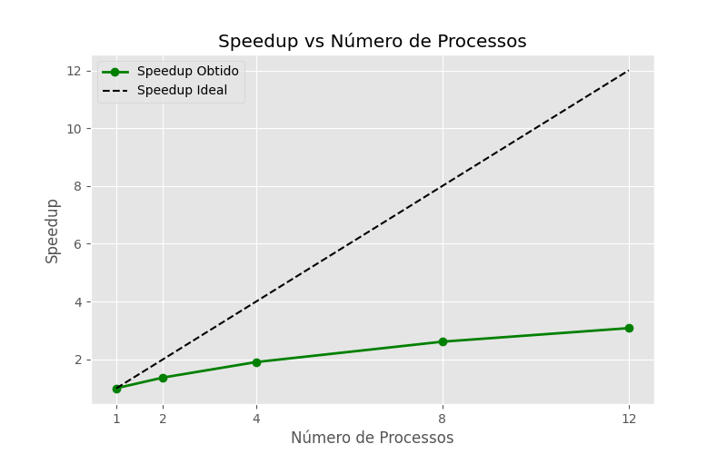
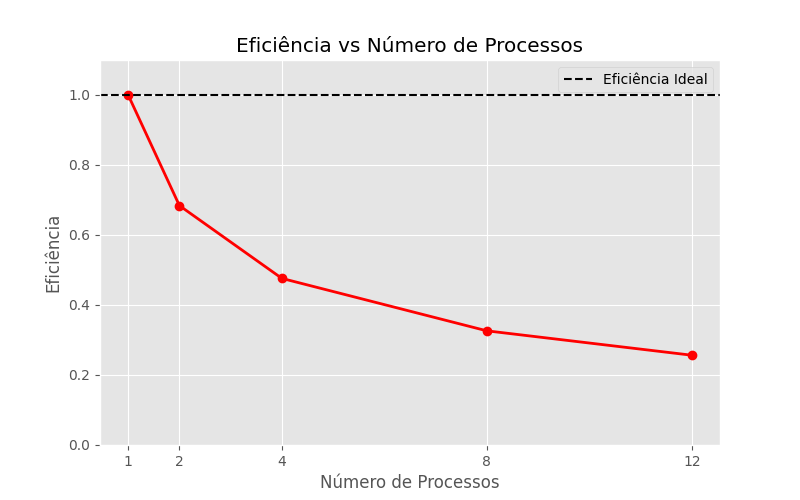

# Relatório da NOME DA ATIVIDADE

**Disciplina: Sistemas de Informaçaõ** 
**Aluno(s): Luiz Maia**
**Turma: Sistemas de Informação Noturna**
**Professor: Rafael Marques**
**Data: 08/04/2026**

---

# 1. Descrição do Problema

O problema computacional resolvido por este programa é a medição de similaridade de textos aplicados ao Processamento de Linguagem Natural (NLP). O algoritmo implementado realiza a comparação de similaridade de Jaccard entre pares de perguntas para identificar duplicatas.O volume de dados processado provém do arquivo nlp_features_train.csv (dataset Quora Question Pairs do Kaggle). O algoritmo realiza tokenização e comparação de conjuntos (Jaccard), possuindo uma complexidade de tempo aproximada de $O(N^2)$ em relação ao número de perguntas, já que compara cada pergunta com todas as subsequentes. O objetivo da paralelização com MPI é distribuir a carga do laço de repetição externo entre múltiplos processos, reduzindo drasticamente o tempo de execução total.

# 2. Ambiente Experimental

| Item                        | Descrição                                   |
| --------------------------- | ---------                                   |
| Processador                 | Intel Core i7-12700                         |
| Número de núcleos           | 12 físicos / 20 lógicos                     |
| Memória RAM                 | 16 GB 3200Mhz                               |
| Sistema Operacional         | Windows 11                                  |
| Linguagem utilizada         | Python 3.13.2                               |
| Biblioteca de paralelização | MPI (mpi4py)                                |
| Compilador / Versão         | VS CODE                                     |

---

# 3. Metodologia de Testes

A medição de tempo de execução foi realizada utilizando a função time.time() da biblioteca padrão do Python, capturando o instante de tempo logo após o carregamento e preparação dos dados e subtraindo do instante logo após a união dos resultados (comm.gather).

Configurações testadas
Os experimentos foram realizados nas seguintes configurações de paralelismo:

1 processo (versão serial nativa - avaliadormpi.py) Com somente 1 núcleo

2 processos (avaliadormpi.py)

4 processos (avaliadormpi.py)

8 processos (avaliadormpi.py)

12 processos (avaliadormpi.py)

Procedimento experimental

Foi realizada uma execução para cada configuração de processos. O tamanho da entrada foi limitado às primeiras 5000 perguntas do dataset, a fim de viabilizar o processamento e o tráfego de dados via MPI sem estourar o limite de memória no envio para o processo raiz. O ambiente de execução foi a máquina local.

# 4. Resultados Experimentais

| Nº Threads/Processos | Tempo de Execução (s) |
| -------------------- | --------------------- |
| 1                    |           33.09       |
| 2                    |           24.19       |
| 4                    |           17.38       |
| 8                    |           12.68       |
| 12                   |           10.75       |

---

# 5. Cálculo de Speedup e Eficiência

## Fórmulas Utilizadas

### Speedup

```
Speedup(p) = T(1) / T(p)
```

Onde:

* **T(1)** = tempo da execução serial
* **T(p)** = tempo com p threads/processos

### Eficiência

```
Eficiência(p) = Speedup(p) / p
```

Onde:

* **p** = número de threads ou processos

---

# 6. Tabela de Resultados

Preencha a tabela abaixo utilizando os tempos medidos.

| Threads/Processos | Tempo (s) | Speedup | Eficiência |
| ----------------- | --------- | ------- | ---------- |
| 1                 |    33.09  | 1.0     | 1.0        |
| 2                 |    24.19  | 1.37    | 0.68       |
| 4                 |    17.38  | 1.90    | 0.48       |
| 8                 |    12.68  | 2.61    | 0.33       |
| 12                |    10.75  | 3.08  | 0.26       |

---

# 7. Gráfico de Tempo de Execução



---

# 8. Gráfico de Speedup



---

# 9. Gráfico de Eficiência



---

# 10. Análise dos Resultados

A aplicação apresentou uma escalabilidade sublinear. O speedup não acompanhou a linha ideal: ao utilizar 4 processos, o speedup foi de apenas 1.90 (quando o ideal seria 4), e com 12 processos, atingiu 3.08.

A eficiência começou a cair de forma imediata, caindo para 0.68 logo com 2 processos e chegando a apenas 0.26 com 12 processos. Essa perda de desempenho e baixo speedup podem ser explicados por dois gargalos principais:

Overhead de Comunicação (MPI): A função comm.gather exige que todos os processos enviem arrays gigantescos de resultados para o Processo 0. O tempo gasto trafegando e juntando esses dados na memória ofusca o ganho de tempo do processamento paralelo.

Concorrência de Hardware: Dependendo da quantidade de núcleos físicos da máquina, o uso de 12 processos gera context switching (troca de contexto) excessivo no processador, o que também diminui a eficiência.

# 11. Conclusão

O paralelismo trouxe um ganho de desempenho, reduzindo o tempo de execução de 33.09 segundos (serial) para 10.75 segundos (12 processos). No entanto, o programa não escala de forma ideal. O ganho marginal de tempo diminui significativamente conforme mais processos são adicionados (a diferença de 8 para 12 processos foi de menos de 2 segundos, mas a eficiência despencou).

Para implementações futuras, a principal melhoria seria mudar a abordagem de comunicação: em vez de usar comm.gather para enviar todos os milhões de pares avaliados, cada processo deveria ordenar seus próprios resultados e enviar apenas o seu "Top 20" para o processo principal. Isso eliminaria o gargalo de rede e memória do MPI.
